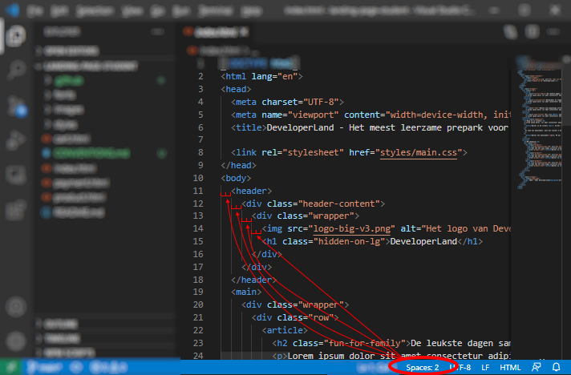

# Conventies

Een CONVENTIONS.md legt de conventies vast die in dit project gebruikt moeten worden. Je moet je hier aan houden.

## Inspringen

In dit project springen we in (tabben) met 2 spaties. Dat wil zeggen dat als we een element binnenin een div zetten we 2 spaties verder gaan.

In Visual Studio Code (en andere code-editors) kun je instellen hoeveel spaties de 'TAB'-knop op jouw keyboard plaatst. Dat doe je onderin de blauwe balk. Vaak wordt dit automatisch gedetecteerd wanneer je een bestand opent.

## Naamgevingen

**Bestandsnamen en classnamen** zijn altijd `kebab-case`. 

* Goede voorbeelden: `example-file.png`, `side-by-side`, `index`
* Slecht voorbeelden: `example_file.png`, `Example-File.png`, `SideBySide`, `Index`

**In de main.css** staan:

1. Algemene regels bovenaan (bijv.: html, body, h1 t/m 6, a, table etc.)
2. Daarna classes en id's
3. Onderaan komen eerst de media queries
4. Helemaal onderaan staan @keyframes voor animaties

